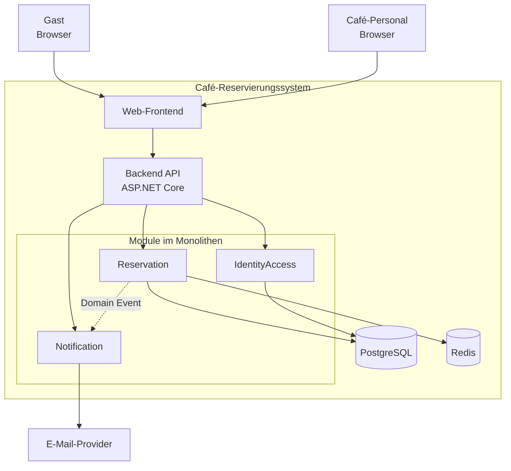
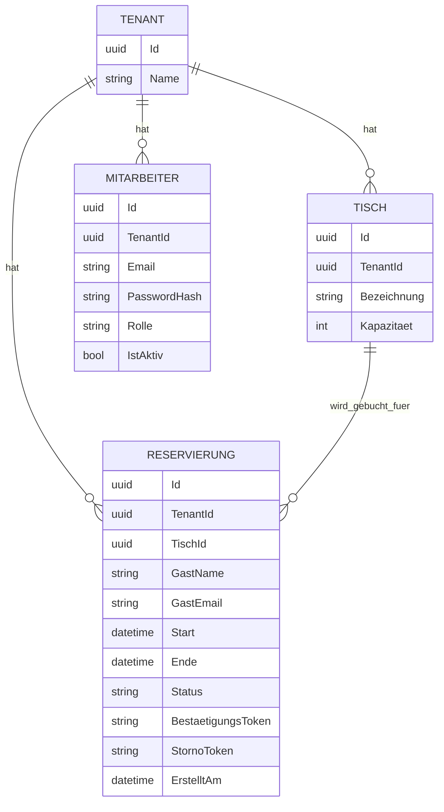
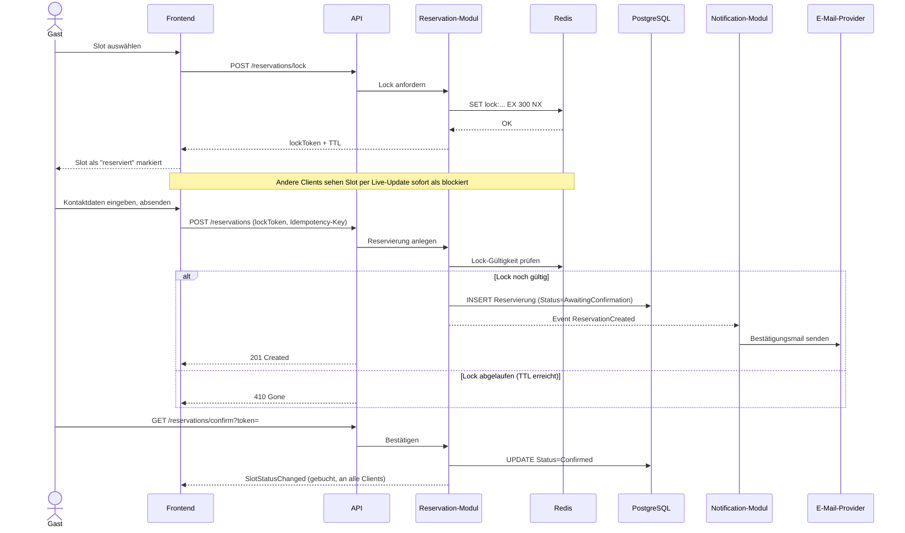
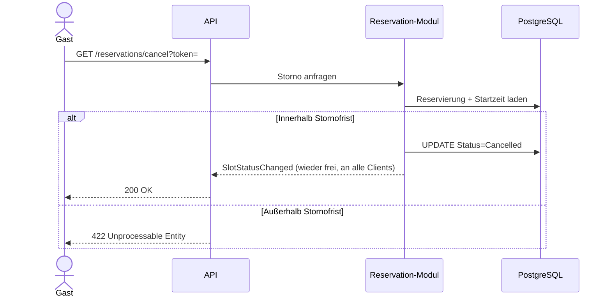

# Café-Reservierungssystem – Projektplanung

## Ausgangsszenario
Fiktives eigenes Café. Eigene Software statt Fremdprodukt (gastronovi, Resmio etc.), weil bewusst selbst gebaut als Portfolio-Projekt. Zielveröffentlichung: GitHub (Code, Doku, Diagramme).

## Vision (langfristig)
Modular aufgebautes Café-/Gastro-Management-System, das schrittweise um weitere Module erweiterbar ist. Multi-Tenant-fähig von Anfang an, damit später auch andere Cafés das System nutzen könnten.

## Scope – Version 1

**Reservierungs-Modul**
- Tisch-/Slot-Verwaltung, Verfügbarkeitsprüfung
- Kollisionsfreie, idempotente Buchungslogik
- Echtzeit-Slot-Sperrung: Slot wird bei Auswahl sofort für alle Clients als "blockiert" markiert (Soft Lock mit Timeout, z. B. 5–10 Min.), nicht erst nach Abschluss der Buchung; nach Ablauf automatische Freigabe, falls nicht abgeschlossen
- Verfügbarkeitsänderungen werden live an alle verbundenen Clients propagiert (z. B. WebSockets/SSE)
- Gast bucht ohne Konto → Bestätigung per E-Mail-Link

**Identity & Access-Modul** (nur Café-Personal, nicht für Gäste)
- Login für Café-Personal
- Multi-Tenant: jeder Nutzer fest einem Café (Tenant) zugeordnet
- Rollen v1: *Owner* (volle Rechte), *Mitarbeiter* (Reservierungen einsehen/bearbeiten, keine Einstellungen) – bewusst grob gehalten, kein granulares Permission-System

**Notification-Modul**
- E-Mail-Versand (Bestätigungslink bei Reservierung)
- Eigenständiges Modul, da später von mehreren Stellen genutzt (Storno, Erinnerung, ggf. Warteliste)

## Architektur-Prämisse
Klare Modul-/Domänengrenzen (je Modul eigene Verantwortung, eigenes Schema), damit spätere Module (siehe unten) sauber andocken können, ohne bestehende Module anzufassen.

## Nicht-funktionale Anforderungen

**Security**
- Schutz gegen SQL-Injection (ausschließlich parametrisierte Queries/ORM)
- Schutz gegen XSS und CSRF im Web-Frontend
- Auth & Access Control für Admin-Bereich (Identity & Access-Modul), inkl. Schutz vor Broken-Access-Control (Tenant-Grenzen serverseitig erzwingen, nicht nur im Frontend)
- Rate Limiting auf öffentlichen Endpunkten (Buchung, Login) gegen Spam/Brute-Force/einfache DDoS-Muster
- Sauberes Exception-Handling: keine Stacktraces, interne Fehlerdetails oder Datenbankmeldungen nach außen; einheitliches Fehlerformat
- Secrets (DB-Zugangsdaten, API-Keys etc.) nicht im Code/Repo, sondern über Umgebungsvariablen/Secret-Management
- Eingabevalidierung serverseitig für alle Endpunkte (nicht nur Frontend-Validierung)

**Betrieb & Deployment**
- Containerisiert (Docker) von Anfang an
- Lauffähig sowohl lokal/Single-Server als auch später orchestriert (Kubernetes) – keine Architekturentscheidungen, die das ausschließen
- Konfiguration über Umgebungsvariablen (12-Factor-Prinzip), damit Umgebungswechsel ohne Code-Änderung möglich ist

**Architektur-Leitprinzipien**
- Modularität: Komponenten/Module lose gekoppelt, über klar definierte Schnittstellen, austauschbar ohne Kaskadeneffekte auf andere Module
- Skalierbarkeit: zustandslose Anwendungsschicht wo möglich, damit horizontale Skalierung (mehrere Instanzen) später möglich ist
- Wartbarkeit: konsistente Code-Konventionen, Testabdeckung, Dokumentation je Modul

Details (konkrete Technologien, Grenzwerte, genaue Umsetzung) folgen in der Architektur-Planungsphase – hier nur als bindende Leitplanken für spätere Entscheidungen festgehalten.

## Nicht-Ziele v1 (explizit "nicht jetzt", nicht "nie")
- Warteliste für Walk-ins
- Kundenkonten für Gäste
- Bezahlsystem / Kassensystem (POS)
- Lagerverwaltung
- Personalplanung
- Buchhaltung
- Externe Lieferdienst-Integrationen

## Ziele (funktional, v1)
- Gast reserviert Tisch für Zeitfenster online, ohne Konto
- Keine Doppelbuchung bei parallelen Zugriffen auf denselben Slot
- Café-Personal (eingeloggt) sieht/verwaltet Reservierungen über Weboberfläche
- Mandantentrennung: Café A hat keinen Zugriff auf Daten von Café B

## Erfolgskriterien
- Race-Condition-Test: parallele Buchungsversuche auf denselben Slot → genau eine erfolgreiche Buchung
- Idempotenz nachweisbar (Retry derselben Anfrage erzeugt keine doppelte Reservierung)
- Mandantentrennung nachweisbar, auch bei versuchter API-Manipulation
- Live-Update nachweisbar: Slot-Status ändert sich bei allen verbundenen Clients ohne manuelles Neuladen
- Grundlegende Security-Checks bestehen (z. B. automatisierter Scan auf SQLi/XSS, keine Secrets im Repo)
- Lasttest zeigt definierte Antwortzeiten unter definierter Last (Zahlen folgen)

---

## Schritt 2: Anforderungsanalyse

### Funktionale Anforderungen (User Stories)

**Gast (kein Konto)**
- Als Gast möchte ich verfügbare Zeitslots einsehen, um einen Tisch zu reservieren.
- Als Gast möchte ich einen Tisch für ein Zeitfenster reservieren; der Slot wird sofort für alle als blockiert markiert (Soft Lock).
- Als Gast möchte ich meine Reservierung per E-Mail-Link bestätigen, damit sie verbindlich wird.
- Als Gast möchte ich meine Reservierung über einen Link stornieren können, sofern die Stornofrist (24–48h vor Termin, konfigurierbar) noch nicht abgelaufen ist.

**Mitarbeiter (eingeloggt)**
- Als Mitarbeiter möchte ich mich einloggen, um Zugriff auf die Reservierungsverwaltung zu bekommen.
- Als Mitarbeiter möchte ich alle Reservierungen (Tages-/Wochenübersicht) einsehen.
- Als Mitarbeiter möchte ich eine Reservierung bearbeiten oder stornieren (z. B. bei telefonischer Anfrage).
- Als Mitarbeiter möchte ich manuell eine Reservierung anlegen (Telefonbuchung, Laufkundschaft).

**Owner (eingeloggt, erweiterte Rechte)**
- Als Owner möchte ich Mitarbeiter-Konten anlegen, bearbeiten und deaktivieren.
- Als Owner möchte ich alle Rechte eines Mitarbeiters zusätzlich zur Kontoverwaltung haben.

**System**
- Ein Soft-Lock wird nach Ablauf des Timeouts automatisch freigegeben, ohne manuelles Eingreifen.
- Bei Reservierung, Stornierung und (optional) Erinnerung wird automatisch eine E-Mail versendet.

### Nicht-funktionale Anforderungen (Konkretisierung zu Schritt 1)
- Stornofrist: fixer, konfigurierbarer Wert (Richtwert 24–48h), in v1 als Konfigurationswert hinterlegt, nicht pro Café im UI einstellbar
- Tenant-Modell: v1 exakt ein Tenant, per Migration/Seed angelegt, kein Onboarding-UI; `tenant_id` ist von Anfang an Pflichtfeld auf allen relevanten Entitäten, damit ein späteres Onboarding-Modul ohne Schemabruch ergänzt werden kann
- Tischbestand: v1 fest per Migration/Seed-Daten, kein Owner-UI; Datenmodell/Domänenlogik so geschnitten, dass eine spätere CRUD-Oberfläche nur ergänzt, nicht die bestehende Logik verändert

### Priorisierung (MoSCoW, v1)

**Must have**
- Verfügbarkeit einsehen (Gast)
- Reservierung mit Soft-Lock, Live-Update, E-Mail-Bestätigung
- Kollisionsfreie, idempotente Buchung
- Mitarbeiter-Login, Mandantentrennung
- Reservierungsübersicht für Mitarbeiter/Owner

**Should have**
- Gast-Stornierung per Link mit Fristprüfung
- Manuelle Reservierungserstellung durch Mitarbeiter
- Owner verwaltet Mitarbeiter-Konten

**Could have**
- Erinnerungsmail vor dem Termin

**Won't have (v1)**
- Owner-UI für Tischverwaltung
- Tenant-Onboarding-Flow
- Alle bereits in Schritt 1 gelisteten Nicht-Ziele (Warteliste, Kundenkonten, Bezahlsystem, Lager, Personalplanung, Buchhaltung, Lieferdienst-Integrationen)

### MVP-Abgrenzung
MVP = alle "Must have"-Punkte; das System ist damit alleine lauffähig und demonstriert den vollen technischen Anspruch (Concurrency, Idempotenz, Live-Updates, Mandantentrennung). "Should have" folgt danach und verbessert den Betriebskomfort, ist vom MVP aber sauber trennbar.

---

---

## Schritt 3: Architektur-Planung

### Architekturstil
**Modularer Monolith.** Ein Deployment, intern strikt getrennte Module (`Reservation`, `IdentityAccess`, `Notification`) mit klar definierten Schnittstellen, kein direkter Zugriff auf die Datenbank-Tabellen eines anderen Moduls. Ermöglicht sauberen späteren Schnitt zu Microservices (Refactoring statt Rewrite), ohne den Ops-Aufwand von Tag 1 an zu tragen.

### Tech-Stack
- **Sprache/Framework:** C# / .NET (Praxisaufbau für neuen Job)
- **ORM:** EF Core mit Npgsql-Provider (PostgreSQL-Anbindung); Exclusion Constraints werden von EF Core nicht nativ über die Modellkonfiguration unterstützt – müssen manuell als rohes SQL in der generierten Migration ergänzt werden
- **Primäre Datenbank:** PostgreSQL – Source of Truth, finale Buchungskorrektheit über Exclusion Constraints (`tsrange` + GIST-Index verhindert überlappende Reservierungen auf DB-Ebene) bzw. Unique Constraints
- **Cache/Ephemeral Store:** Redis – zwei Aufgaben:
  - Soft Lock mit TTL (Slot wird beim Auswählen kurzzeitig automatisch gesperrt, läuft ohne Cleanup-Job von selbst ab)
  - Backplane für Live-Updates bei mehreren Instanzen (siehe unten)
- **Echtzeit-Kommunikation:** SignalR (.NET-Bibliothek auf WebSocket-Basis) für Server→Client-Push bei Verfügbarkeitsänderungen; mit Redis-Backplane, damit Updates instanzübergreifend ankommen, sobald horizontal skaliert wird (Kubernetes)
- **Frontend:** Angular (vorhandene Erfahrung, offizieller SignalR-JS-Client, TypeScript-Typisierung)
- **Test-Framework:** xUnit (Standard in der .NET-Welt, gute Integration mit `WebApplicationFactory` für Integrationstests)

### Kurzglossar (für später)
- **TTL (Time To Live):** Ablaufzeit eines Cache-Eintrags, danach automatisch entfernt
- **WebSocket:** dauerhafte, bidirektionale Verbindung Server↔Client (Server kann aktiv pushen, statt dass Client pollt)
- **Backplane:** zentraler Vermittler (hier: Redis Pub/Sub), der bei mehreren App-Instanzen dafür sorgt, dass ein Event auf Instanz 1 auch Clients erreicht, die mit Instanz 2 verbunden sind

### Modul-Kommunikation
Jedes Modul hat einen kleinen öffentlichen Vertrag (Interfaces + DTOs), Entities und DB-Zugriff bleiben intern (`internal` in C#). Zwei Kommunikationswege:
- **Synchron (Interface-Aufruf):** wenn sofort eine Antwort gebraucht wird, z. B. `Reservation` fragt über `ICurrentUserContext` bei `IdentityAccess` nach Tenant/Rolle
- **Asynchron (In-Process Domain Event, via MediatR):** für Seiteneffekte, ohne dass das auslösende Modul das reagierende kennt, z. B. `Reservation` löst `ReservationConfirmed` aus, `Notification` abonniert es und verschickt die Mail

### Komponentenübersicht (Container-Ebene)



---

## Schritt 4: Datenmodellierung



`TenantId` steht bewusst auf jeder Tabelle, damit Mandantentrennung auf jeder einzelnen Abfrage direkt erzwingbar ist (nicht nur implizit über Beziehungen).

**Primärschlüssel: UUIDv7** statt UUIDv4 – enthält einen Zeitstempel-Anteil, dadurch grob zeitlich sortiert (neue Einträge landen im DB-Index "hinten dran" statt an zufälliger Stelle), besser für Index-Performance bei wachsenden Tabellen, bleibt weiterhin global eindeutig. .NET 9 unterstützt das nativ (`Guid.CreateVersion7()`).

**Datenfluss Redis ↔ PostgreSQL:**
1. Gast wählt Slot → Soft Lock nur in Redis (`lock:{tenantId}:{tischId}:{start}`, TTL 5–10 Min.), noch keine DB-Zeile
2. Gast gibt Kontaktdaten ein, sendet ab → `RESERVIERUNG`-Zeile in PostgreSQL, Status = `AwaitingConfirmation`, Bestätigungs-Mail raus
3. Gast klickt Bestätigungslink → Status = `Confirmed`
4. Soft Lock läuft ab, bevor Schritt 2 passiert → Slot einfach wieder frei, nie eine DB-Zeile entstanden
5. `AwaitingConfirmation`-Reservierung nie bestätigt → Hintergrundjob setzt sie nach Timeout auf `Expired`, Slot wird frei

## Offene Punkte (für spätere Planungsschritte)
- Konkrete Lastziele (parallele Nutzer, Antwortzeiten)
- Testkonzept, CI/CD
- Monitoring-Dashboard (z. B. Grafana) – bewusst nicht v1, spätere Ausbaustufe

---

## Schritt 5: API-Design

### Auth-Entscheidung: Cookie statt JWT im LocalStorage
Zwei gängige Wege, einen eingeloggten Nutzer bei jedem Request wiederzuerkennen:
- **JWT im LocalStorage:** Token wird im Browser-Speicher abgelegt, JavaScript liest ihn aus und schickt ihn mit. Risiko: **XSS** (Cross-Site Scripting) – kann Angreifer eigenes JavaScript in die Seite einschleusen (z. B. über eine ungefilterte Eingabe), liest dieses Script den Token einfach mit aus und der Angreifer ist eingeloggt.
- **HttpOnly-Cookie (unsere Wahl):** Cookie ist für JavaScript unsichtbar, das Auslesen per XSS entfällt. Dafür wird das Cookie vom Browser automatisch bei jedem Request mitgeschickt – auch bei Requests, die eine bösartige fremde Seite auslöst (**CSRF**, Cross-Site Request Forgery: Opfer ist bei uns eingeloggt, besucht nebenbei eine präparierte Seite, die im Hintergrund einen Request an unsere API schickt, Cookie geht automatisch mit). Schutz dagegen: Anti-Forgery-Token, das zusätzlich zum Cookie mitgeschickt werden muss und das eine fremde Seite nicht kennen kann.

Kurz: Cookie+Anti-Forgery-Token schützt vor dem Diebstahl-Szenario (XSS), verlangt dafür eine zusätzliche Maßnahme gegen ein anderes Szenario (CSRF) – in Summe der robustere Ansatz für einen Admin-Bereich.

### Konventionen
- **Stil:** REST, JSON, URL-Versionierung (`/api/v1/...`)
- **API-Dokumentation:** OpenAPI-Spezifikation, automatisch generiert über Swashbuckle (.NET-Bibliothek), dargestellt via Swagger UI – auch Praxis fürs neue Job-Umfeld
- **Fehlerformat:** RFC 7807 Problem Details (`{type, title, status, detail, traceId}`), keine Stacktraces/DB-Fehler nach außen
- **Idempotenz:** `Idempotency-Key`-Header verpflichtend bei buchungserzeugenden POST-Requests
- **Statuscodes Buchungsfall:** `409 Conflict` (Slot inzwischen belegt), `410 Gone` (Soft Lock abgelaufen), `422 Unprocessable Entity` (ungültiger Zustandsübergang, z. B. Storno nach Fristablauf)

### Logging
- Strukturiertes Logging (z. B. Serilog), nicht nur Freitext – jede Log-Zeile mit `traceId`, `tenantId`, Zeitstempel, Log-Level
- `traceId` aus dem Log identisch mit `traceId` in der Problem-Details-Antwort → Nutzer-Fehlermeldung und Server-Log sind direkt verknüpfbar
- Keine sensiblen Daten im Log (keine Passwörter, keine vollständigen Tokens)
- v1: Logs laufen in strukturierter Form auf Konsole/Datei; Auswertung/Dashboard (Grafana o. ä.) bewusst spätere Ausbaustufe, aber strukturiertes Format jetzt schon vorbereiten, damit es sich nahtlos anschließen lässt

### Öffentliche Endpunkte (Gast, kein Login)

| Methode | Pfad | Zweck |
|---|---|---|
| GET | `/api/v1/tenants/{tenantId}/availability?date=` | Verfügbare Slots/Tische für einen Tag |
| POST | `/api/v1/tenants/{tenantId}/reservations/lock` | Soft Lock auf Slot setzen, liefert `lockToken` + TTL |
| POST | `/api/v1/reservations` | Reservierung anlegen (`lockToken` + Gastdaten, `Idempotency-Key` Pflicht) |
| GET | `/api/v1/reservations/confirm?token=` | Reservierung per E-Mail-Link bestätigen |
| GET | `/api/v1/reservations/cancel?token=` | Stornieren (nur innerhalb der Frist) |

### Live-Updates
- SignalR-Hub `/hubs/availability`, Client abonniert nach `tenantId`, empfängt `SlotStatusChanged`-Events (frei/gesperrt/gebucht)

### Admin-Endpunkte (Mitarbeiter/Owner, eingeloggt, Cookie-Auth)

| Methode | Pfad | Zweck | Rolle |
|---|---|---|---|
| POST | `/api/v1/auth/login` | Login, setzt HttpOnly-Cookie | alle |
| GET | `/api/v1/tenants/{tenantId}/reservations?date=` | Reservierungsübersicht | Mitarbeiter+ |
| PATCH | `/api/v1/reservations/{id}` | Bearbeiten/Stornieren durch Personal | Mitarbeiter+ |
| POST | `/api/v1/tenants/{tenantId}/reservations/manual` | Manuelle Buchung | Mitarbeiter+ |
| POST | `/api/v1/tenants/{tenantId}/staff` | Mitarbeiter-Konto anlegen | Owner |
| PATCH | `/api/v1/staff/{id}` | Mitarbeiter bearbeiten/deaktivieren | Owner |

Jeder Endpunkt mit `tenantId` in der Route wird serverseitig zusätzlich geprüft: eingeloggter Nutzer muss zu genau diesem Tenant gehören (Schutz vor Broken Access Control).

---

## Schritt 6: Diagramme & Visualisierung
Komponentendiagramm siehe Schritt 3, ER-Diagramm siehe Schritt 4.

**Sequenzdiagramm: Buchungsablauf (inkl. Soft-Lock)**



**Sequenzdiagramm: Stornierung durch Gast**



---

## Schritt 7: Projektstruktur & Repo-Setup

### Ordnerstruktur (Repo-Root)

```
/src
  Cafe.Api/                        → ASP.NET Core Host: Program.cs, DI-Wiring, Controller/Endpoints
  Cafe.Modules.Reservation/        → Domain, Application, Infrastructure (je Unterordner)
  Cafe.Modules.IdentityAccess/
  Cafe.Modules.Notification/
  Cafe.SharedKernel/               → modulübergreifende Contracts/Basistypen (bewusst minimal)
/tests
  Cafe.Modules.Reservation.Tests/
  Cafe.Modules.IdentityAccess.Tests/
  Cafe.IntegrationTests/           → z. B. Race-Condition-Tests gegen echte Postgres/Redis-Instanz (Testcontainers)
/frontend
  cafe-admin-app/                  → Angular-Projekt
/docs
  adr/                             → Architecture Decision Records
  diagrams/
/deploy
  docker-compose.yml
  k8s/                             → später
.editorconfig
.gitignore
README.md
CHANGELOG.md
```

Jedes Modul unter `/src` ist intern in `Domain` (Entities, Geschäftsregeln), `Application` (Use Cases, Interfaces) und `Infrastructure` (EF-Core-Konfiguration, Repository-Implementierung) unterteilt.

### Namenskonventionen
- C#: PascalCase für Namespaces/Klassen, Namespace folgt Ordnerstruktur (`Cafe.Modules.Reservation.Domain`)
- Angular: kebab-case für Dateien/Komponenten
- Branches: `feature/<kurzbeschreibung>`, `fix/<kurzbeschreibung>`, `chore/<kurzbeschreibung>`

### Branching-Strategie
**GitHub Flow**: `main` immer deploybar, jede Änderung über kurzlebigen Feature-Branch + Pull Request, danach Branch löschen. Kein GitFlow (dauerhafte `develop`/`release`-Branches) – lohnt sich erst bei parallelen Release-Ständen/mehreren Teams.

### Commit-Konventionen
**Conventional Commits** (`feat:`, `fix:`, `docs:`, `refactor:`, `test:`, `chore:`) – lesbare Historie, automatisch generierbares Changelog.

### Sonstiges
- `.editorconfig`: einheitliche C#-Formatierung, IDE-unabhängig
- `.gitignore`: Standard-Templates für .NET + Node/Angular + IDE-Ordner (`bin/`, `obj/`, `node_modules/`, `.vs/`, `.vscode/`, `.idea/`), plus OS-Metadaten (`.DS_Store` für macOS, `Thumbs.db` für Windows)

### Entwicklungsumgebung
- **Betriebssysteme**: aktuell Windows, perspektivisch auch macOS (Wechsel geplant) – Setup bewusst plattformunabhängig gehalten, Terminal-Befehle in Anleitungen müssen für beide OS funktionieren (z. B. PowerShell kennt kein `mkdir -p`, Mac-Terminal/zsh schon)
- **IDE**: JetBrains Rider (kostenlos für nicht-kommerzielle Nutzung seit Ende 2024) – läuft identisch auf Windows/macOS, deckt C#/.NET und Angular/TypeScript in einer IDE ab
- **Datenbank-Tools**: PostgreSQL über Riders eingebauten DB-Client (kein Extra-Tool); Redis über RedisInsight (Keys, Werte, TTL-Anzeige – wichtig zur Kontrolle des Soft-Lock-Mechanismus)
- **API-Testing**: Swagger UI reicht für die meisten Fälle; optional Insomnia/Postman für komplexere Auth-Testszenarien
- **Voraussetzungen**: .NET SDK, Node.js/npm, Docker Desktop, Git

## Offene Punkte (für spätere Planungsschritte)
- Konkrete Lastziele (parallele Nutzer, Antwortzeiten)
- Testkonzept, CI/CD
- Monitoring-Dashboard (z. B. Grafana) – bewusst nicht v1, spätere Ausbaustufe

---

## Schritt 8: Testkonzept

### Vorgehen: gezieltes TDD
Kein pauschales TDD über das ganze Projekt. Gezielt Test-zuerst (Red-Green-Refactor) für die Kernlogik im Reservation-Modul – insbesondere Concurrency/Idempotenz –, weil das erwartete Verhalten dort von Anfang an klar spezifizierbar ist (deckt sich mit den Erfolgskriterien aus Schritt 1). Für simple CRUD-Endpunkte und das Angular-Frontend: test-after (Implementierung, danach Test, vor dem PR). Bei technischem Neuland (EF-Core-Exclusion-Constraints, Redis-Locking-Patterns) zuerst ein kurzer Spike zum Verstehen der Technik, erst danach sinnvoll testbar.

### Teststrategie (Testpyramide)

**Unit Tests** – größter Anteil, schnell, ohne echte DB/Redis
- Reine Domain-/Geschäftslogik pro Modul isoliert getestet (z. B. "darf dieser Statusübergang stattfinden?", Validierungsregeln)
- Framework: xUnit

**Integration Tests** – kleinerer, aber für dieses Projekt besonders wichtiger Anteil
- Laufen gegen echte PostgreSQL- und Redis-Instanzen via Testcontainers (startet Docker-Container automatisch pro Testlauf) – kein Mocking der DB, weil genau das Zusammenspiel (Exclusion Constraint, Redis-TTL) der Punkt ist, den wir beweisen wollen
- Hier leben die Erfolgskriterien aus Schritt 1 als konkrete Tests:
  - Race-Condition-Test: N parallele Requests auf denselben Slot → genau einer erfolgreich
  - Idempotenz-Test: gleicher `Idempotency-Key` mehrfach gesendet → keine doppelte Reservierung
  - Mandantentrennung: Zugriff auf Tenant-fremde Daten → 403/404, nicht 200
  - Soft-Lock-Ablauf: TTL abgelaufen → Slot ist danach nachweislich wieder frei

**End-to-End Tests** – bewusst wenige, nur die wichtigsten Abläufe
- Tool: Playwright
- Abgedeckt: kompletter Gast-Flow (Slot wählen → Soft Lock sichtbar → Buchen → Bestätigungsmail → Confirmed), kompletter Personal-Flow (Login → Reservierung sehen/bearbeiten)

**Frontend Unit Tests (Angular)**
- Jest statt Standard-Karma/Jasmine (schneller, weiter verbreitet, bessere Watch-Mode-Erfahrung)

### Testabdeckung
Kein pauschales Coverage-Prozentziel – stattdessen: kritische Pfade müssen vollständig abgedeckt sein (Buchungslogik, Auth/Access Control, Tenant-Isolation), alles andere sinnvoll, aber nicht erzwungen. Coverlet zur reinen Sichtbarkeit im Repo (Badge), nicht als CI-Gate.

### Testdaten
- Jeder Integrationstest bekommt eine frische, migrierte DB (Testcontainers-Standardverhalten) – keine geteilten/verschmutzten Testdatenbestände
- Testdaten-Erzeugung über Builder-Pattern (z. B. `ReservationBuilder.ForTable(x).AtSlot(y).Build()`) statt kopierter Objekte in jedem Test

### Tools (Zusammenfassung)
xUnit, Testcontainers, Playwright, Jest, Coverlet

## Offene Punkte (für spätere Planungsschritte)
- Konkrete Lastziele (parallele Nutzer, Antwortzeiten)
- CI/CD
- Monitoring-Dashboard (z. B. Grafana) – bewusst nicht v1, spätere Ausbaustufe

---

## Schritt 9: CI/CD & Automatisierung

### CI-Pipeline
GitHub Actions, läuft bei jedem Push und PR gegen `main`:
1. Build (Backend `dotnet build`, Frontend `ng build`)
2. Lint/Format-Check (`dotnet format --verify-no-changes`, ESLint)
3. Unit Tests (xUnit + Jest)
4. Integration Tests (Testcontainers, über GitHub Actions Service Containers)
5. Security-Scan (CodeQL)
6. Coverage-Report (Coverlet, als Artefakt/Badge, kein Gate)

Branch Protection Rule auf `main`: Merge nur, wenn alle Schritte grün sind.

### CD-Strategie
Bewusst zurückhaltend für v1 ("nur für dich"-Betrieb):
- Bei Merge auf `main`: Docker-Image wird gebaut und in die GitHub Container Registry (GHCR) gepusht
- Tatsächliches Deployment (Hochfahren des Images) bleibt v1 manuell (`docker compose pull && up`) – automatischer Deploy auf ein Zielsystem/K8s ist spätere Ausbaustufe, sobald ein fester Zielort existiert

### Code-Qualität
- Dependabot aktiviert (automatische PRs bei veralteten/unsicheren Abhängigkeiten)
- CodeQL bereits Teil der CI-Pipeline (siehe oben)

### Pre-Commit-Hooks
Bewusst kein verpflichtender Pre-Commit-Hook (Skript, das lokal vor jedem `git commit` automatisch läuft) – die CI fängt Formatierungs-/Lint-Fehler ohnehin ab, zusätzlicher lokaler Zwang bringt bei einem Solo-Projekt wenig. Optional: `dotnet format` lokal vor dem Commit, aber nicht erzwungen.

### Kurzglossar (für später)
- **Lint/Format-Check:** automatische Prüfung auf einheitlichen Code-Stil (Einrückung, Namenskonventionen, unbenutzte Imports) – nicht ob der Code funktioniert, sondern ob er sauber aussieht
- **CodeQL:** automatischer Sicherheits-Scanner von GitHub, durchsucht Code nach bekannten Schwachstellenmustern (z. B. SQL-Injection-Stellen), kostenlos für öffentliche Repos
- **Docker-Image:** fertig verschnürte, komplette Version der Anwendung, die auf jedem System identisch startet
- **GHCR (GitHub Container Registry):** Lagerplatz für Docker-Images, direkt ans GitHub-Repo gekoppelt, kein separater Account nötig
- **Dependabot:** automatischer Wächter für genutzte Bibliotheken/Pakete, erstellt von selbst Pull Requests bei veralteten/unsicheren Versionen
- **Branch Protection Rule:** GitHub-Einstellung, die verhindert, dass Code in `main` gemergt wird, solange nicht alle Checks (Build, Tests, Scans) grün sind

## Offene Punkte (für spätere Planungsschritte)
- Konkrete Lastziele (parallele Nutzer, Antwortzeiten)
- Monitoring-Dashboard (z. B. Grafana) – bewusst nicht v1, spätere Ausbaustufe

---

## Schritt 10: Dokumentation

- **README.md** (Repo-Root): erste Anlaufstelle – Projektbeschreibung, Setup (`docker compose up`), Link zur Swagger-UI-API-Doku, kurzer Architektur-Überblick mit Verweis auf `/docs`
- **ADRs (Architecture Decision Records)** in `/docs/adr/`: eine Markdown-Datei pro wichtiger Entscheidung (z. B. `0001-modularer-monolith.md`), jede nach Schema *Kontext* (welches Problem), *Entscheidung* (was gewählt), *Konsequenzen* (Vor-/Nachteile, die in Kauf genommen werden) – hält fest, *warum* eine Entscheidung fiel, nicht nur *was* entschieden wurde
- **CHANGELOG.md**: Versionshistorie nach [Keep a Changelog](https://keepachangelog.com/)-Format (Abschnitte Added/Changed/Fixed je Version), später automatisiert aus den Conventional-Commit-Nachrichten generierbar
- **CONTRIBUTING.md**: für v1 knapp (Solo-Projekt), enthält Setup-Schritte für lokale Entwicklung (Tests starten, Migrationen ausführen)
- **Code-Dokumentation**: XML-Doc-Kommentare (`/// <summary>`) für öffentliche Interfaces/Methoden in C# (IDE-Tooltips, generierbare API-Referenz); Kommentare nur dort, wo das *Warum* nicht aus dem Code selbst hervorgeht (z. B. "warum TTL genau 5 Minuten")

## Offene Punkte (für spätere Planungsschritte)
- Konkrete Lastziele (parallele Nutzer, Antwortzeiten)
- Monitoring-Dashboard (z. B. Grafana) – bewusst nicht v1, spätere Ausbaustufe

---

## Schritt 11: Sicherheit

Bereits in Schritt 1 festgehalten (nicht wiederholt): Injection-Schutz, XSS/CSRF-Schutz, Access Control/Tenant-Grenzen, Rate Limiting, Exception-Handling, Secrets-Management, Eingabevalidierung.

**Neu ergänzt:**
- **Threat-Modeling light**: relevanteste Angriffsflächen – öffentliche Buchungs-Endpunkte (Spam/Bots), Admin-Login (Credential-Stuffing/Brute-Force), Soft-Lock-Mechanismus (Missbrauchspotenzial: gezielt alle Slots blockieren ohne zu buchen, "Denial of Inventory") → Rate Limiting explizit auch auf dem `lock`-Endpunkt, nicht nur auf der eigentlichen Buchung
- **Passwort-Hashing**: ASP.NET Core Identity (Standard-PBKDF2-Hashing), kein eigenes Verfahren bauen
- **Rate Limiting konkret**: eingebaute ASP.NET Core Rate Limiting Middleware (seit .NET 7, keine Zusatzbibliothek)
- **Eingabevalidierung konkret**: FluentValidation (deklarative, testbare Validierungsregeln pro DTO)
- **CORS**: nur die eigene Frontend-Domain als erlaubter Origin (Browser-Mechanismus, der regelt, von welchen fremden Seiten aus JavaScript Requests an unsere API schicken darf)
- **Security-Header**: HSTS (erzwingt HTTPS), Content-Security-Policy (schränkt erlaubte Skript-/Ressourcenquellen ein, zusätzliche Verteidigung gegen XSS), `X-Content-Type-Options: nosniff`
- **Audit-Log für Admin-Aktionen**: separates Log (wer hat wann welche Reservierung storniert/bearbeitet), unabhängig vom technischen Anwendungs-Log aus Schritt 5
- **Datenschutz (DSGVO)**: Gastdaten (Name, E-Mail) sind personenbezogene Daten – Aufbewahrungsfrist definieren (z. B. automatische Löschung X Monate nach Termin), Lösch-Mechanismus als Hintergrundjob einplanen (reiner Storno-Endpunkt reicht nicht für tatsächliche Datenlöschung)

## Offene Punkte (für spätere Planungsschritte)
- Konkrete Lastziele (parallele Nutzer, Antwortzeiten)
- Monitoring-Dashboard (z. B. Grafana) – bewusst nicht v1, spätere Ausbaustufe

---

## Schritt 12: Deployment & Infrastruktur

- **Hosting v1**: Docker Compose auf einem einzelnen, kleinen Server (z. B. günstiger VPS oder eigene Hardware) – passend zum "nur für dich"-Betrieb, kein Cluster-Overhead nötig, solange nur ein Tenant existiert
- **Spätere Ausbaustufe**: Azure (Container Apps oder AKS) – naheliegend, da stackwork laut Stellenausschreibung Azure App Service/Service Bus nutzt und die Container-/Kubernetes-Vorbereitung aus Schritt 3 genau darauf einzahlt
- **Umgebungstrennung**: ASP.NET-Core-Standardmechanismus (`appsettings.Development.json` / `appsettings.Production.json`) plus Umgebungsvariablen für alles Geheime (Connection Strings, Redis-Verbindung); Docker Compose bekommt pro Umgebung eine eigene `.env`-Datei
- **Helm-Charts** (Kubernetes-Paketierung): bewusst nicht v1, erst relevant sobald tatsächlich auf einem Cluster deployt wird

## Offene Punkte (für spätere Planungsschritte)
- Konkrete Lastziele (parallele Nutzer, Antwortzeiten)
- Monitoring-Dashboard (z. B. Grafana) – bewusst nicht v1, spätere Ausbaustufe

---

## Schritt 13: Projektmanagement & Roadmap

**Meilensteine**:
1. **M1 – Fundament**: Repo-Setup, Solution-Struktur, Datenmodell + Migrationen, Auth-Grundgerüst (Login, Rollen)
2. **M2 – Kernlogik**: Reservation-Modul mit Soft-Lock, Idempotenz, Race-Condition-Absicherung – inkl. TDD-Tests dafür (höchster technischer Anspruch, deshalb früh)
3. **M3 – API & Echtzeit**: REST-Endpunkte, SignalR-Live-Updates, Swagger
4. **M4 – Frontend**: Angular-Admin-Oberfläche + Gast-Buchungsseite
5. **M5 – Produktionsreife**: CI/CD-Pipeline, Deployment, Doku (README, ADRs) für die GitHub-Veröffentlichung

**Aufgabenverwaltung**: GitHub Issues + GitHub Projects (Kanban-Board). Epics = Module/Meilensteine, einzelne Aufgaben als verlinkte Issues darunter.

**Definition of Done** (pro Pull Request): Tests grün, CI-Pipeline grün, bei architekturrelevanten Änderungen zugehöriges ADR ergänzt/aktualisiert, README bei Bedarf angepasst.

**Risiken**:
- Zeit: Nebenprojekt neben neuem Job – Meilensteine bewusst klein geschnitten für sichtbaren Fortschritt auch bei wenig Zeit
- Komplexität: Concurrency-/Locking-Themen oft unterschätzt – deshalb M2 bewusst vor dem Frontend, mit Zeitpuffer
- Wissenslücken bei neuen Technologien (EF-Core-Exclusion-Constraints, SignalR-Backplane, Angular-Auffrischung) – kurze Spikes vor der Implementierung einplanen (siehe TDD-Vorgehen, Schritt 8)

---

## Schritt 14: Open-Source-Aspekte

Dieser Schritt betrifft nicht die Software selbst, sondern wie professionell sie für externe Betrachter (Recruiter, Interviewer, andere Entwickler) beim Öffnen des GitHub-Repos wirkt – die "Verpackung" der vorherigen technischen Arbeit.

- **Lizenz: MIT** – rechtlich relevant, nicht nur stilistisch: ohne Lizenz-Datei gilt bei einem öffentlichen Repo automatisch "alle Rechte vorbehalten" (Urheberrecht greift standardmäßig), niemand dürfte den Code streng genommen kopieren/wiederverwenden, selbst zum Lernen nicht. MIT erlaubt jedem die Nutzung/Veränderung/auch kommerzielle Nutzung, einzige Bedingung: Lizenzhinweis (inkl. Autorenname) bleibt erhalten – das ist bewusste Entscheidung gegen GPL (die zusätzlich verlangen würde, dass abgeleitete, weiterverbreitete Projekte ebenfalls offen bleiben): MIT ist die Konvention für Portfolio-Projekte, GPL wirkt hier unüblich und lenkt vom eigentlichen Zweck (Code zeigen) ab. Ein Repo ohne Lizenz wirkt bei technisch versierten Betrachtern unfertig.
- **Code of Conduct**: Verhaltensregeln für Mitwirkende – relevant erst, wenn ein Projekt aktiv fremde Beiträge/eine Community erwartet. Für ein Solo-Portfolio-Projekt ohne Fremdbeiträge nicht anwendbar, deshalb v1 nicht nötig.
- **Repo-Metadaten**: betreffen Auffindbarkeit und ersten Eindruck, bevor überhaupt die README gelesen wird. **Topics** = durchsuchbare Schlagworte auf GitHub (z. B. `dotnet`, `angular`) – macht das Repo bei GitHub-Suchen überhaupt erst auffindbar. **Description** = Einzeiler in Suchergebnissen/Repo-Listen. **Social-Preview-Bild** = das Bild, das beim Teilen des Links (z. B. LinkedIn) automatisch angezeigt wird – ohne bewusste Wahl oft ein generischer, wenig aussagekräftiger Screenshot.
- **Badges im README**: kleine Status-Icons (Build-Status, Testabdeckung, Lizenz) – signalisieren auf einen Blick, ohne Code lesen zu müssen, dass eine CI-Pipeline läuft und das Projekt gepflegt wird, nicht nur einmal hochgeladen und vergessen.

---

## Schritt 15: Detaillierter Umsetzungsplan (Backlog)

Konkrete, sequenzielle Aufgaben pro Meilenstein aus Schritt 13 – das eigentliche "was mache ich als Nächstes"-Dokument.

**M1 – Fundament**
1. Lokale Umgebung: .NET SDK, Docker Desktop, Node.js/Angular CLI installieren (falls fehlend)
2. GitHub-Repo anlegen, Ordnerstruktur aus Schritt 7 einrichten (`.gitignore`, `.editorconfig`)
3. Walking Skeleton: leeres `Cafe.Api`-Projekt + Dockerfile + `docker-compose.yml` (App + PostgreSQL + Redis) zum Laufen bringen
4. CI-Grundgerüst (GitHub Actions: Build-Stufe), auch ohne echte Tests
5. EF Core + Npgsql einrichten, Verbindung zu PostgreSQL testen
6. Entities aus Schritt 4 anlegen (Tenant, Tisch, Mitarbeiter, Reservierung), erste Migration inkl. manueller Exclusion-Constraint-SQL
7. Seed-Daten (ein Tenant, Beispiel-Tische) einspielen
8. Identity & Access: Login-Endpunkt, Cookie-Auth, Rollen Owner/Mitarbeiter, Anti-Forgery-Token
9. Erstes ADR schreiben (z. B. `0001-modularer-monolith.md`) als Vorlage für weitere

**M2 – Kernlogik**
1. Spike: Redis-Locking-Pattern (`SET NX EX`) isoliert ausprobieren
2. Spike: EF-Core-Migration mit Exclusion Constraint zum Laufen bringen
3. Reservation-Domain: Statusübergänge (AwaitingConfirmation → Confirmed/Expired/Cancelled) per TDD als Unit-Tests definieren
4. Soft-Lock-Logik implementieren + Tests
5. Buchungs-Use-Case inkl. Idempotency-Key-Handling
6. Race-Condition-Integrationstest (Testcontainers, N parallele Requests)
7. Bestätigungs-/Storno-Flow inkl. Fristprüfung
8. Hintergrundjob: Ablauf nicht bestätigter Reservierungen

**M3 – API & Echtzeit**
1. REST-Endpunkte aus Schritt 5 (öffentlich + Admin)
2. Swagger/Swashbuckle einrichten
3. RFC-7807-Fehlerformat + globale Exception-Handling-Middleware
4. Rate-Limiting-Middleware konfigurieren
5. SignalR-Hub + Redis-Backplane
6. Notification-Modul: E-Mail-Versand über MediatR-Events
7. Strukturiertes Logging (Serilog) mit traceId

**M4 – Frontend**
1. Angular-Projekt aufsetzen, Grundlayout
2. Gast-Ansicht: Verfügbarkeitskalender, Soft-Lock-Anzeige, Buchungsformular
3. SignalR-Client-Anbindung für Live-Updates
4. Admin-Login + Reservierungsübersicht
5. Mitarbeiter-Verwaltung (Owner-Ansicht)
6. E2E-Tests (Playwright) für Gast- und Personal-Flow

**M5 – Produktionsreife**
1. CI-Pipeline vervollständigen (Lint, Integrationstests, CodeQL, Coverage-Report)
2. CD: Docker-Image-Build + Push zu GHCR bei Merge auf `main`
3. README, restliche ADRs, CHANGELOG-Grundgerüst
4. Repo-Metadaten (Topics, Description, Social-Preview), LICENSE-Datei (MIT)
5. Lasttest durchführen, Lastziele konkretisieren und dokumentieren
6. Finaler Review vor Veröffentlichung

## Offene Punkte (für spätere Planungsschritte)
- Konkrete Lastziele (parallele Nutzer, Antwortzeiten)
- Monitoring-Dashboard (z. B. Grafana) – bewusst nicht v1, spätere Ausbaustufe
